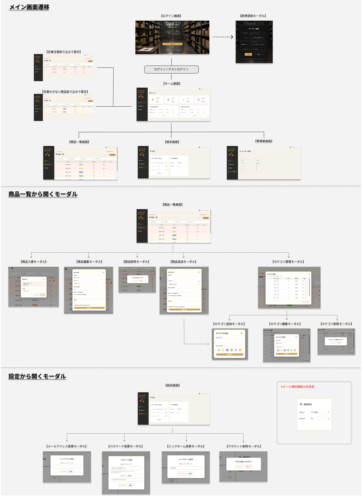
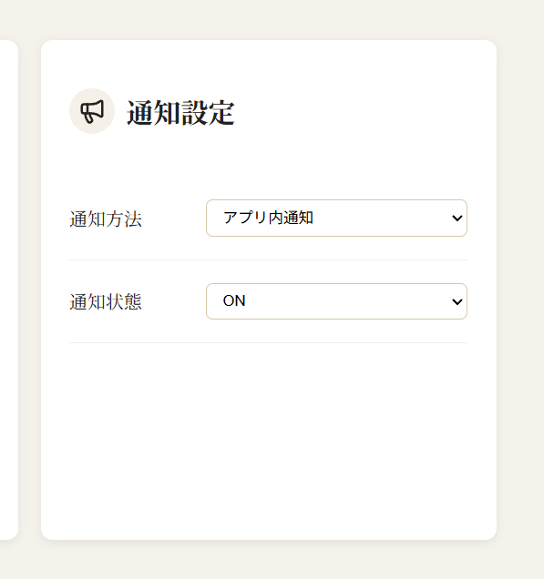
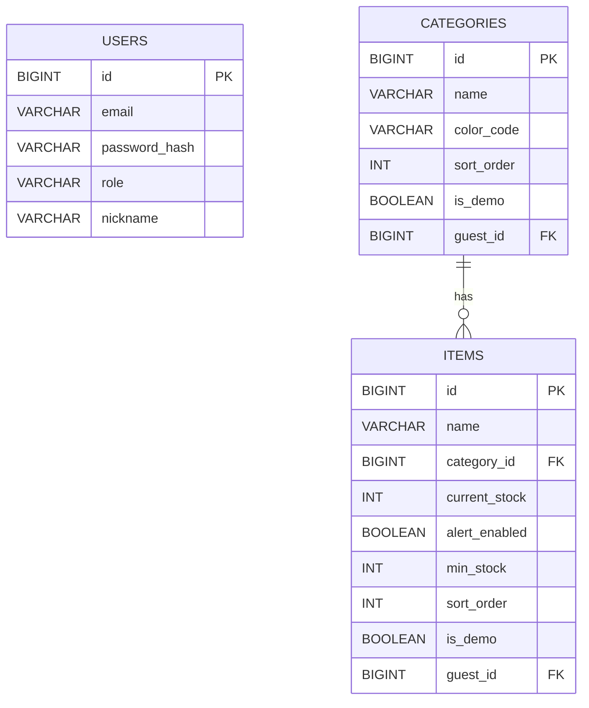

## 🔗アプリURL

[INVENTORY MANAGER](https://inventory-manager-pf.netlify.app/)


## 🔎概要

店舗で使用する商品の在庫を管理するWebアプリです。

商品ごとの在庫数を簡単に確認・更新できるほか、
設定した基準値を下回った商品を在庫注意として確認できるようにすることで、
発注が必要な商品の見落としを防ぎ、店舗の在庫管理を効率化します。

## 🎯制作背景

美容師として働く中で、在庫確認や発注作業に手間がかかることに加え、
在庫が少なくなっていることに気づくのが遅れ、
商品が必要になったタイミングで在庫切れが発覚し、その際に他店舗へ
商品を借りに行くこともあり、在庫管理の非効率さを課題に感じていました。

そこで、商品の在庫数を簡単に確認・更新でき、
在庫が少なくなった商品を把握できる在庫管理アプリを制作しました。

## ⚙️主な機能

- 商品の登録・編集・削除
- 商品一覧の表示・並び替え
- 在庫数の増減・更新
- 在庫状況の確認
- カテゴリによる商品の絞り込み・カテゴリ管理
- ユーザー登録とログイン・ログアウト機能
- ユーザー設定（メールアドレス・パスワード・ニックネーム変更）
- ロール別権限管理(管理者のみ)
- ゲストログインによるデモ操作

## 🔧主な使用技術

### バックエンド

- Java 21 / Spring Boot 4.1.0

### フロントエンド

- React 19.2.8 / Node.js 24.19.0 / JavaScript / CSS

### インフラ・DB

- AWS ( VPC , EC2 , RDS , ALB , ACM )
- MySQL 8.0

### データアクセス

- Spring Data JPA

### 開発環境・ツール

- Postman
- Git
- GitHub
- Visual Studio Code
- IntelliJ IDEA

## 🏷️技術選定理由

### Spring Boot

Javaでのバックエンド開発を学習することを目的として採用しました。
またSpring Bootを通してREST APIの構築や、
Spring Securityを利用した認証・認可の仕組みを理解したいと考え採用しました。

### React

フロントエンド技術について調べる中で、Reactが広く利用されていることを知り、
実務で使用される機会が多い技術を学びたいと考え採用しました。
またコンポーネント単位でUIを管理できるため、
商品一覧やモーダルなどを整理しやすくなると思ったのも採用理由です。

## 💡工夫した点

### 在庫数を直感的に確認できるUI

在庫数だけでなく、在庫状況を視覚的に把握できるように、
在庫数に応じて表示を変えるUIを実装しました。
在庫状況を「正常」「少ない」「注意」の3段階で視覚的に把握できるようにしています。

### 誤操作を防ぐ在庫変更

在庫数を増減する操作では、変更内容を確認してから確定できるようにし、
誤操作による在庫数の変更を防止しています。

<details>
<summary>👇実装コード</summary>

```javascript
const [stockChange, setStockChange] = useState(0);

const handleStockChange = async (item, newStock) => {
  const updatedStock = await updateStockApi(item, newStock);

  onUpdateStock(updatedStock);
};
// ...

// 在庫を減らす
setStockChange((prev) => Math.max(prev - 1, -item.currentStock));
// ...

// 在庫を増やす
setStockChange((prev) => prev + 1);
// ...

// 決定ボタンで変更を確定
if (stockChange !== 0) {
              handleStockChange(item, item.currentStock + stockChange);
   }
// ...
```
</details>

### ゲストログイン機能

閲覧するユーザーがすぐにアプリを体験できるよう、 ゲストログイン機能を実装しました。

ゲストログイン時にはゲストユーザーごとにゲストアカウントとデモデータを作成し、
商品・カテゴリにゲストユーザーIDを紐づけることで、
複数のゲストユーザーが同時に利用してもデータが干渉しないようにしています。

また、ログアウト時にはゲストユーザーに紐づくデモデータとゲストアカウントを削除し、
データが残り続けないようにしています。

<details>
<summary>👇実装コード</summary>

```java
public void createDemoData(Long guestId) {
  Map<Long, Category> categoryMap = createDemoCategories(guestId);

  createDemoItems(categoryMap, guestId);
}

private Map<Long, Category> createDemoCategories(Long guestId) {
  // 実際のデータのカテゴリを取得
  List<Category> realCategories = 
      categoryRepository.findAllByIsDemoAndGuestId(false, null);

  List<Category> demoCategories = new ArrayList<>();
  Map<Long, Category> categoryMap = new HashMap<>();

  for (Category realCategory : realCategories) {
    Category demoCategory = new Category();

    demoCategory.setName(realCategory.getName());
    demoCategory.setColorCode(realCategory.getColorCode());
    
    // ゲストごとのデモデータとして登録
    demoCategory.setIsDemo(true);
    demoCategory.setGuestId(guestId);

    demoCategories.add(demoCategory);
    
    // 元カテゴリIDとデモカテゴリを対応付け
    categoryMap.put(realCategory.getId(), demoCategory);
  }
  categoryRepository.saveAll(demoCategories);
  return categoryMap;
}

private void createDemoItems(Map<Long, Category> categoryMap, Long guestId) {
  // 実際のデータの商品を取得
  List<Item> realItems = 
      itemRepository.findAllByIsDemoAndGuestIdOrderBySortOrderAsc(false, null);

  List<Item> demoItems = new ArrayList<>();

  for (Item realItem : realItems) {
    Item demoItem = new Item();

    demoItem.setName(realItem.getName());
    demoItem.setCurrentStock(realItem.getCurrentStock());
    demoItem.setAlertEnabled(realItem.getAlertEnabled());
    demoItem.setMinStock(realItem.getMinStock());
    demoItem.setSortOrder(realItem.getSortOrder());
    demoItem.setIsDemo(true);
    demoItem.setGuestId(guestId);
    
    // ゲスト用カテゴリに紐付け
    Category demoCategory = categoryMap.get(realItem.getCategory().getId());

    demoItem.setCategory(demoCategory);

    demoItems.add(demoItem);
  }

  itemRepository.saveAll(demoItems);
}

@Transactional
  public void deleteDemoData() {
    Long guestId = getCurrentGuestId();
    
  // ゲストユーザーに紐づくデモデータを削除
    itemRepository.deleteAllByIsDemoAndGuestId(true,guestId);
    categoryRepository.deleteAllByIsDemoAndGuestId(true,guestId);
    usersRepository.deleteById(guestId);
  }
```
</details>

## 🚨苦労した点・解決策

### 画面構成の見直し

#### 【問題】

はじめは、商品一覧画面のみの構成で設計していましたが、
商品一覧画面を作り終えて実際に自分で使ってみると、
在庫が少ない商品状況の確認やユーザー設定などの機能を商品一覧画面だけで管理するよりも、
画面を分けたほうが使いやすいと感じました。

#### 【解決策】

商品一覧画面だけでなく、ホーム画面・商品一覧・設定・ユーザー管理(adminのみ)の
4画面に分け、各画面へ移動しやすいようにサイドバーを追加しました。

### ゲストログインの設計変更

#### 【問題】

はじめは、1つのゲストアカウントを複数のユーザーで共有する設計にしていました。

ですが、Web上で公開することを考えると、 複数のユーザーが同時にゲストログインした場合、
同じデータを操作することでデータが干渉する可能性があると思いました。

#### 【解決策】

ゲストログインするたびにゲストアカウントを作成し、 ゲストユーザーごとにデモデータを作成する設計へ変更しました。

商品・カテゴリにゲストユーザーIDを紐づけることで、
複数のゲストユーザーが同時に利用しても、それぞれ独立したデモデータを操作できるようにしました。

また、ログアウト時にはゲストユーザーと紐づくデモデータを削除することで、
不要なデータが残らないようにしています。

## 🗺️画面遷移図

アプリ全体の画面遷移と、各画面から開くモーダルをまとめています。



## 💭今後の実装予定

### 設定画面の通知設定

メール通知機能を実装予定です。



## 🔵DB設計

### users

| カラム           | 内容           |
|---------------|--------------|
| id            | 主キー          |
| email         | メールアドレス      |
| password_hash | ハッシュ化したパスワード |
| role          | 権限           |
| nickname      | ニックネーム       |

### categories

| カラム        | 内容      |
|------------|---------|
| id         | 主キー     |
| name       | カテゴリ名   |
| color_code | カテゴリカラー |
| sort_order | 表示順     |
| is_demo  | デモデータかどうか |
| guest_id | ゲストユーザーID |

### items

| カラム           | 内容         |
|---------------|------------|
| id            | 主キー        |
| name          | 商品名        |
| category_id   | カテゴリID     |
| current_stock | 現在の在庫数     |
| alert_enabled | アラートON/OFF |
| min_stock     | アラート基準値    |
| sort_order    | 商品の並び順     |
| is_demo  | デモデータかどうか |
| guest_id | ゲストユーザーID |

## 認証方式

セッション認証を使用してログイン状態を管理します。
パスワードはハッシュ化して保存します。

## 🟡ER図


###### ※ユーザー設計について

単一店舗での利用を想定しているため、商品・カテゴリは店舗内で共有して管理します。

一方、Web上でのデモ利用では複数ユーザーが同時に利用する可能性を考慮し、
実際のデータをコピーしたデモデータをゲストユーザーごとに分離しています。

## 🟢 APIのURL設計

### 商品API

| HTTPメソッド | URL | 処理内容 |
|---|---|---|
| GET | `/api/items` | 商品一覧取得 |
| POST | `/api/items` | 商品登録 |
| PUT | `/api/items/{id}` | 商品更新 |
| DELETE | `/api/items/{id}` | 商品削除 |
| PATCH | `/api/items/{id}/stock` | 在庫数更新 |

### カテゴリAPI

| HTTPメソッド | URL | 処理内容 |
|---|---|---|
| GET | `/api/categories` | カテゴリー一覧取得 |
| POST | `/api/categories` | カテゴリー登録 |
| PUT | `/api/categories/{id}` | カテゴリー更新 |
| DELETE | `/api/categories/{id}` | カテゴリー削除 |

### 認証・ユーザーAPI

| HTTPメソッド | URL | 処理内容 |
|---|---|---|
| POST | `/api/auth/login` | ログイン |
| POST | `/api/auth/register` | ユーザー登録 |
| PATCH | `/api/auth/{id}/role` | ユーザー権限変更 |
| PATCH | `/api/auth/email` | メールアドレス変更 |
| PATCH | `/api/auth/password` | パスワード変更 |
| PATCH | `/api/auth/nickname` | ニックネーム変更 |
| DELETE | `/api/auth` | ユーザー削除 |
| GET | `/api/auth/users` | ユーザー一覧取得 |

### ゲストAPI

| HTTPメソッド | URL | 処理内容 |
|---|---|---|
| POST | `/api/guest/login` | ゲストログイン |
| POST | `/api/guest/logout` | ゲストログアウト |

## ⏳開発ステータス

- ✅ 商品登録・削除
- ✅ 商品一覧表示
- ✅ カテゴリによる絞り込み
- ✅ 在庫数の増減・更新
- ✅ ログイン機能
- ✅ ログイン画面作成
- ✅ Spring Security導入
- ✅ ユーザー新規登録機能
- ✅ ロール別権限管理
- ✅ ホーム画面作成
- ✅ ゲストアカウント作成
- ✅ ゲストログインの複数人対応
- ✅ 商品・カテゴリの編集
- ✅ 商品の並び替え
- ✅ AWS RDSへの移行
- ✅ デプロイ・公開
- ⬜ メール通知機能